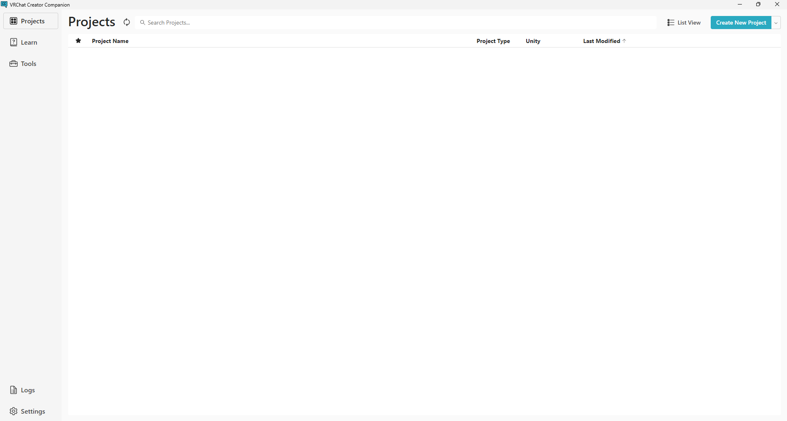

# VCC Recovery Tool

## これは何？
PCが突然死するなどしてVRChat Creator Companion(VCC)が必要とする`settings.json`ファイルが壊れてしまったときにProjectsの復元をサポートするツールです。

## いつ使うの？

こうなったときです。 
（このツールはVCCに登録されているProjectsを検出するため、既にいくつかProjectsが登録されていても正しく動作します。） 
うっかりProjectをRemove(削除)してしまった場合も使えると思います。（未検証）

## 仕組みを教えて
あなたがアバターやワールドを作成・改変したUnity Projectsが初期フォルダの`%localappdata%\VRChatProjects`にあると**仮定して**、その中にあるフォルダをProjectsとしてVCCの`settings.json`に登録します。 
変更している場合や、VRChatProjectsにUnityProjectではないフォルダが含まれていた場合も確認の上処理を行いますので、普段使いするツールではありません。 

## どうやって使うの？
1. Pythonをインストール済みの方は`recovery.py`を、インストールしていない方や、よく分からない方は`recovery.exe`をダウンロードして起動
1. 「settings.json が壊れています。処理を中止します。」と表示された場合、`settings.json`を手動で修正するか、VCCを開いて初期化してからこのツールを再度起動（非推奨）
1. 画面の指示に従って復元

### 注意点
 - 追加候補はよく確認してください。UnityProject以外が含まれている可能性があります。

## ライセンスを教えて
MIT Licenseです。[ここ](LICENSE)に書いてあります。 
MIT Licenseということはこのツールは自己責任で使ってくださいということです。